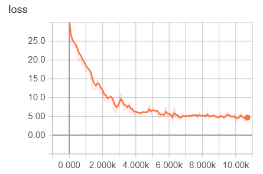

# MiniS2S

Minimum sequence-to-sequence model to demonstrate how to use TensorFlow API.

Visit https://github.com/kiidax/minis2s for the original copy.

This implements basic sequence-to-sequence model with LSTM encoder and decoder to
translate an English word into phone symbols using CMU pronuncing dictionary
(http://www.speech.cs.cmu.edu/cgi-bin/cmudict). The model is very small and will run on
a notebook with 4GB memory.

# Prerequisites

- Python 3.6
- TensorFlow 1.12.0

# Data preparation

```
$ python minis2s.py --mode=datagen --data_dir=data
```

# Training

```
$ python minis2s.py --mode=train --data_dir=data --output_dir=train/minis2s
```



# Inference

```
$ python minis2s.py --mode=infer --data_dir=data --output_dir=train/minis2s
```

Source inputs:

```
P E E P
E X H O R T S
R E A L T O R ( 1 )
B A S A Y E V ( 1 )
F L U F F I E S T
M O O R I S H
H A B I T A B L E
B R O S K Y
O P H T H A L M O L O G I S T S ( 3 )
G R U B E
```

Target outputs:

```
P IY1 P
EH1 K SH ER0 T S
R IY0 L AA1 T ER0
B AE1 S AH0 V
F L AH1 F AH0 T S
M UH1 R IH0 SH
HH EY1 B IH0 T AH0 B AH0 L
B R AA1 S K IY0
AH0 TH F L AE1 M AH0 SH AH0 L IH0 K S
G R UW1 B
```

Ground truth:

```
P IY1 P
IH0 G Z AO1 R T S
R IY1 L T ER0
B AE1 S AA0 Y EH2 F
F L AH1 F IY0 AH0 S T
M UH1 R IH0 SH
HH AE1 B AH0 T AH0 B AH0 L
B R AA1 S K IY0
AA2 F TH AH0 M AA1 L AH0 JH IH0 S
G R UW1 B
```